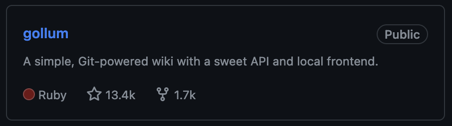

# Introduction

Dawa Ometto (d.l.a.ometto1@uu.nl, @dometto)

UU ITS, Research Engineer

Making life difficult for myself with `git` since 2012:



# Introduction


# Introduction

- Discussing:
  * branches
  * atomic commits
  * merging:
  * fast-forward vs. merge commits vs. rebase vs. squash
- Along the way: what are commits, branches, refs?
- What tools can we use to rewrite git history?
- Practice!

# Materials

"Borrowed" from:

* Utopian Git History (Abel Soares Siqueira, eScience Center, @abelsiqueira)
  * https://blog.esciencecenter.nl/the-utopic-git-history-d44b81c09593
  * https://blog.esciencecenter.nl/achieving-utopic-git-history-4cc2a1fd3107
* Git Legit (Pauline de Vos, @paulinedevos)
  * http://www.pauline-vos.nl/git-legit-cheatsheet/
  * https://www.youtube.com/watch?v=_e5oq4JT4_8
* The git book (Scott Shacon, Ben Straub):
  * https://git-scm.com/book/en/v2/
* Blog posts by Julia Evans (@jvns)
  * https://jvns.ca/blog/2023/11/06/rebasing-what-can-go-wrong-/
  * https://jvns.ca/blog/2023/11/01/confusing-git-terminology/

# Who has used...

- `git commit`
- `git status`, `git add`
-  Pull Requests?
- `git branch`, `git merge`
- `git rebase`
- `git reflog`
- `git cherry-pick`
- `git add -p`
- `git bisect`
- `git cat-file`, `git ls-tree`

# Workflows

Simplest `git` workflow:

1. working on only a single branch (`main`)
2. committing changes with `git commit -a`.

This can already be an improvement over *not* using versioning! But it doesn't work for collaboration.

# Best practice: feature branches

1. Create a branch `<feature>` "branching off" from `main`.
1. Do your work on `<feature>`.
1. Merge the branch into `main`, or open a Pull Request.


# Best practice: atomic commits

How many changes should be contained in a commit?

Strive (!) to make your commits *atomic*:

> The basic idea of an atomic git commit is that it contains the shortest amount of work that does what it is supposed to do. That is, less work would not be enough to do the task, and more work would be going out of scope. (@abelsiqueira)

@paulinevos:

1. Single, irreducible unit. Every commits pertains to one fix or feature.
2. Everything works. Don't break the build on any commit.
3. Clear and concise. Purpose is clear from commit message and description.

# Best practice: atomic commits

> If every commit is an atomic commit, then we have a beautiful git history. Every commit passes tests, so we can easily navigate around. Every commit has a non-creeping purpose, so we can cherry-pick them more easily. Every commit is self-contained, so we can revert them trivially. It is almost utopic, but it is actually attainable. (@abelsiqueira)

General idea: your commit history should tell an understandable story.

# Best practice: atomic commits

Atomic commits help you avoid this:


# Best practice: atomic commits

But creating atomic commits is hard.

We often don't know what logical 'chunks' our work will end up dividing into, until we've done the work -- and we *do* want to have versioning along the way!

# Best practice: atomic commits

Solution:

- As you work on a feature branch, try to make your commits *as* atomic as possible.
- When the work is done, review your commit history on that branch:
  * does it contain needless commits? Remove them!
  * does it contain commits that do *more than one* thing? Split them!
  * does it contain multiple commits that do *less than one* thing? Squash them together!
  * ...we'll need some tools for this!
- Only now open a Pull Request, or merge the branch into `main` yourself.
  * what *merge strategy* is appropriate?

# Merge strategies

On GitHub:


These options correspond to CLI options:

* `git merge --no-ff`
* `git merge --squash`
* `git merge --ff-only` (need to rebase first!)

What is the difference, and which one should we use?
  * Spoiler: all three are legit.

# A note on merge conflicts

Regardless of what merge *strategy* you choose, *merge conflicts* may occur. That is, `git` may be unable to resolve conflicts between:

* changes you have made in your `<feature>` branch.
* changes made in the `main` branch, *after* `<feature>` branched off from `main`.

```
# How to create a merge conflict

<<<<<<< HEAD
First you add a file, but create a conflicting change

on another branch.
=======
First you add a file.

Then you add something on another branch and commit it.
>>>>>>> new_branch
```

# A note on merge conflicts

`git` is clever enough to 'auto-merge' clearly unrelated changes. But if auto-merging fails, you will need to resolve the conflict manually:

1. Edit the files that contain conflicts until you're happy.
1. Mark the conflict as resolved (`git add <filename>`).
1. Tell `git` to continue with your `merge` or `rebase`.

See exercises!

# Commits and merge commits

Every commit is uniquely *defined* by its:

- message
- author info
- date/time
- total state of all the files and directories (*tree*)
- parents

# Commits and merge commits

```
$ git cat-file commit HEAD
tree 7bbb09e5f1ab20c91e0e57be4ec99c49ba482bac
parent 7656a5f45d263eb0d4a09788dc83aae8106970b4
author Dawa Ometto <d.l.a.ometto1@uu.nl> 1704892164 +0100
committer Dawa Ometto <d.l.a.ometto1@uu.nl> 1704892195 +0100

Use more chili
```

So:

  * every commit is a pointer to an entire history.
  * there is not really such a thing as *editing* a commit.

# Commits and merge commits

A merge commit is a commit that has *multiple parents*:

```
tree 10f6a7c3758039f5d24fac9556646c830655fb14
parent 7656a5f45d263eb0d4a09788dc83aae8106970b4
parent a831dcd01638aebb453fb218bbb8eeebc2e2cf69
author Dawa Ometto <d.l.a.ometto1@uu.nl> 1704899151 +0100
committer Dawa Ometto <d.l.a.ometto1@uu.nl> 1704899151 +0100

Merge branch 'noconflict'
```

It forms a 'link' between two different histories.

# Commits and merge commits

Having a merge commit makes the history of a branch *non-linear*:


# Merging without a merge commit

Unlike merge commits, our other two merge strategies yield *linear* histories.

Rebase-and-merge:


# Fast-forwarding

If there have been no new commits to `main` since `<feature>` was created, this is easy:

  * `git` simply records that the branch `main` points to the latest commit in `<feature>`.
  * = fast-forward merge.

# Fast-forwarding

```
testrepo git:(main) $ cat .git/refs/heads/main 
bfe91cdde970ecdffaac357f6253aec288c92396

testrepo git:(main) $ git merge --ff-only feature_branch
Updating bfe91cd..8bbdd62
Fast-forward
 ingredients.txt | 1 +

testrepo git:(main) $ cat .git/refs/heads/main 
8bbdd629aa39af3da8916275ea8be39c412c91a4

testrepo git:(main) $ git cat-file commit 8bbdd629aa39af3da8916275ea8be39c412c91a4
tree 23c56b3e5170e3cb63c037986199320ea2d7d260
parent bfe91cdde970ecdffaac357f6253aec288c92396
author Dawa Ometto <d.l.a.ometto1@uu.nl> 1704907022 +0100
committer Dawa Ometto <d.l.a.ometto1@uu.nl> 1704907022 +0100

This is the commit message of the commit that will be the new HEAD!
```

# Merging without a merge commit

But what if `main` and `<feature>` have divergent histories?

  * then there is no 'link' between the tip of `main` and the start of `<feature>` :-(
  * forunately, we can *recreate* a linear history by *rebasing*.

# Rebasing

`git rebase main` *replays* the changes in your current branch *on top of* the last commit in `main`.

**Goal**: get a history that can be merged with a "fast-forward" again!


# Rebasing

* for every commit on the current branch, `git` applies the changes in that commit on top of the latest commit in `main`.
* merge conflicts may need to be handled for each commit that is 'replayed'.
* NB: potential for losing work
  * you can accidentally delete your own commits in an 'interactive' rebase session
  * if you force push a *public* rebased branch, potential for merge conflicts.
  * **don't push rebased branches that others are also working on**

# Squash-and-merge


Squash-and-merge accomplishes essentially the same thing as rebase-and-merge, but compresses all the changes on `<feature>` into a single commit.

Advantage: you'll only have to handle merge conflicts once.
Disadvantage (?): we lose the history of the feature branch.

# Merge strategies

If we're aiming at having *only* atomic commits in `main`, which merge strategy is appropriate?

- Rebase-and-merge clearly works.
- Merge commits are technically not atomic.
  - ...but do we mind, as long as the commits *in* the merge commit are atomic?
- Squash-and-merge *can* create nicely atomic commits out of the work-in-progress on your feature branch...
  - **iff** your PR is trying to achieve precisely one thing anyway.
  - However, squash-and-merging can ["camouflage"]() and thereby encourage non-atomic commits.

# Merge strategies

Bottom line:

* merge strategy is less important than having sensible, clean commits.
* main appeal of merge commits is not having to learn `rebase`...
* ...but to get sensible, clean commits, you'll have to learn `rebase` anyway :-)

# How to achieve atomic commits

Some tools:

* Using `git commit --amend` to change the contents of the last commit.
* Using the *staging area* to precisely control what is added to a commit:
  * which *files*
  * ...but also which *lines*!
* *Squashing*, *splitting*, and *reordering* commits:
  * `git rebase -i`
* *Stashing* work-in-progress that should not yet be committed (`git stash`).

See exercises!